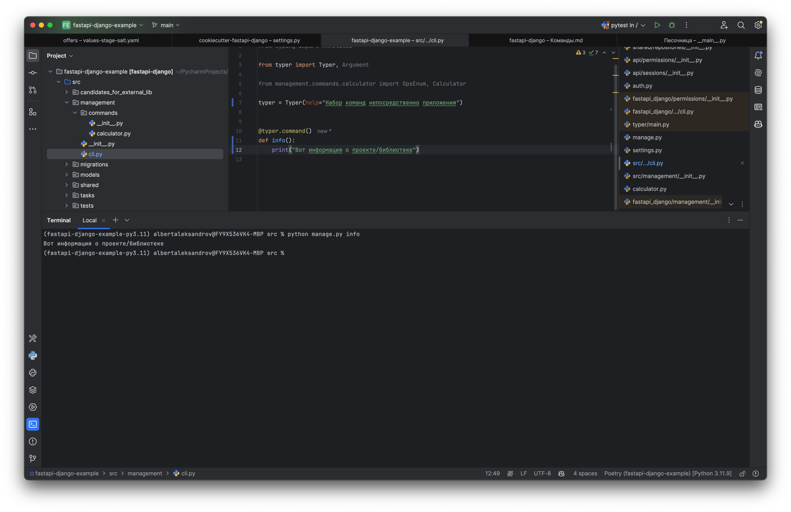
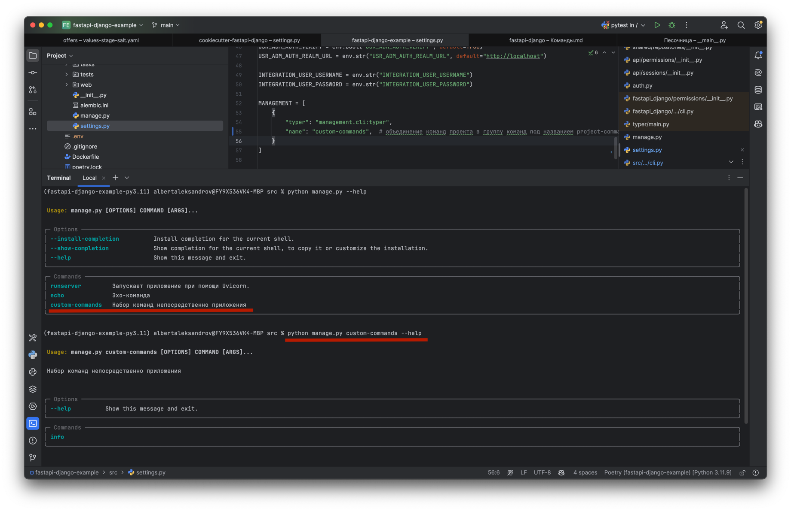

from fastapi_django.conf.global_settings import MANAGEMENT

# Команды

Работа с командами реализована в модуле [management](../fastapi_django/management). Работают команды на [Typer](https://typer.tiangolo.com)

## CLI

Экземпляр Typer и команды созданы в модуле [management/cli.py](../fastapi_django/management/cli.py). Из-за особенностей работы с Typer необходимо, чтобы 
интерпретатор Python при импорте экземпляра Typer проходил также команды, обернутые декоратором `command()`. 

## Дефолтные команды

Реализованы дефолтные команды `echo` и `runserver` (см. [management/cli.py](../fastapi_django/management/cli.py)). 

## Директория management/commands

Дефолтные команды `echo` и `runserver` простые и вполне помещаются в функцию. Однако, если логика громоздкая, то возникает
потребность поместить ее в класс. В таком случае, предлагается размещать в каждый свой файл как это например показано 
по ссылке https://github.com/albertalexandrov/fastapi-django-example/blob/main/src/management/commands/calculator.py. 
Осталось эту логику запустить. Для этого в https://github.com/albertalexandrov/fastapi-django-example/blob/main/src/management/cli.py создается команда, 
которая запускает ее.

## Кастомные команды

Объект `typer` [management/cli.py](../fastapi_django/management/cli.py) является **корневым** CLI, в которому должны 
добавляться кастомные команды. 

Вне зависимости от того, идет ли речь про код приложения FastAPI или некоторой библиотеки предлагается следующий алгоритм
создания кастомных команд. 

1. В проекте/библиотеке создается структура папок и файлов:

```python
management
├── commands (опционально)
    ├── __init__.py 
├── cli.py
```

2. в `cli.py` определяется, настраивается объект `Typer`, реализуются кастомные команды:

```python
# cli.py

from typer import Typer

typer = Typer(help="Команды проекта/библиотеки")


@typer.command()
def info():
    print("Вот информация о проекте/библиотеке")

```

3. Подключение к корневому CLI

Осталось подключить созданный объект typer, который содержит кастомные команды, к корневому CLI. 
Для этого необходимо в настройку MANAGEMENT прописать:

```python
# settings.py

MANAGEMENT = [
    {
        "typer": "management.cli:typer",
    }
]
```

4. Проверка 

Чтобы просмотреть список команд, необходимо выполнить команду `python manage.py --help`:



Можно видеть, что отобразились как дефолтные команды, так и кастомная команд.

Если в настройке MANAGEMENT определить name, то команды будут объединены в субкоманды, доступ к которым будет через
name:

```python
# settings.py

MANAGEMENT = [
    {
        "typer": "management.cli:typer",
        "name": "custom-commands",
    }
]
```


