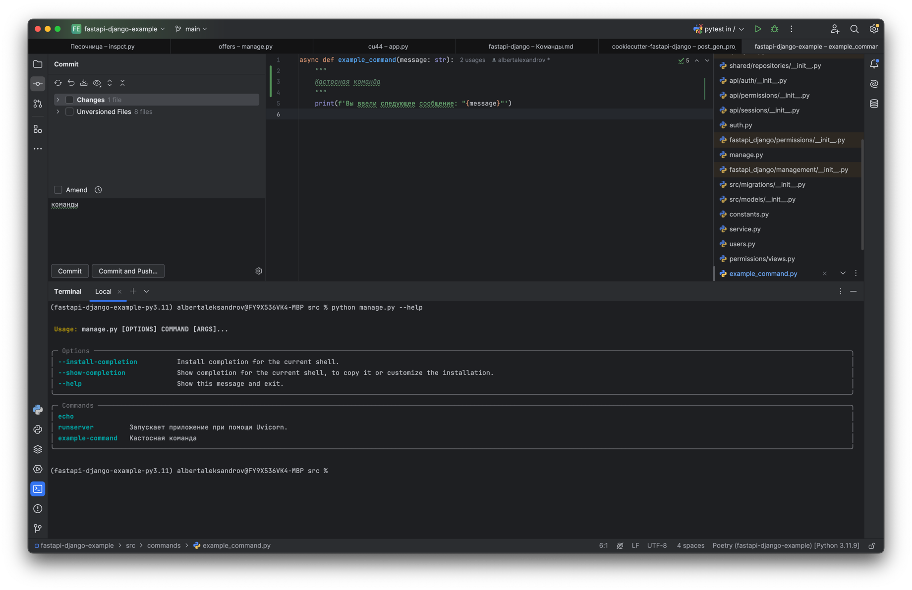

# Команды

Работа с командами реализована в модуле [management](../fastapi_django/management). Работают команды на [Typer](https://typer.tiangolo.com)

В модуле [management/commands](../fastapi_django/management/commands) реализованы дефолтные команды runserver и echo.

По сути manage.py является прокси к приложению на Typer. 

## Кастомные команды

Команда - это callable объект, который может находится в любом месте проекта. Но чтобы команда разаработала, ее необходимо
зарегистрировать. Предлагается регистрировать ее в том же модуле, в котором вызывается приложение Typer, то есть в модуле manage.py
при помоши функции management.utils.register_command.

Пример кастомной команды https://github.com/albertalexandrov/fastapi-django-example/tree/main/src/commands.
Пример регистрации команды: https://github.com/albertalexandrov/fastapi-django-example/blob/main/src/manage.py#L10

## Команда runserver

Данная команда запускает приложение FastAPI при помощи Uvicorn. Если взглянуть на ее реализацию, можно увидеть, 
как она понимает, с какими параметрами необходимо запустить приложение:

```python
def runserver() -> None:
    params = {}
    uvicorn_settings = [setting for setting in dir(settings) if setting.startswith("UVICORN_")]
    for setting in uvicorn_settings:
        _, param = setting.split("_", 1)
        params[param.lower()] = getattr(settings, setting)
    uvicorn.run(**params)
```

Параметры запуска Uvicorn задаются в settings. Названия параметров должны иметь префикс UVICORN_
Далее идут названия параметров функции uvicorn.run в верхнем регистре. Таким образом, параметр,
соответствующий параметру workers будет иметь название UVICORN_WORKERS, для port - UVICORN_PORT и тд

## Список команд

Здесь https://github.com/albertalexandrov/fastapi-django-example/blob/main/src/manage.py#L10 была зарегистрирована 
кастомная команда. Убедится, команда была зарегистрирована можно введя в консоль список всех команд командой:

```shell
python manage.py --help
```



## Примечание

Я рассчитывал, что объект [cli](../fastapi_django/management/__init__.py) будет импортироваться где нужно и 
команды будут автоматически регистрироваться. Однако, недостаточно обернуть функцию в декоратор cli.command, 
поэтому приходится делать так, что команда регистрируется аккурат перед тем, когда выполняется 
cli() ([в файле manage.py](https://github.com/albertalexandrov/fastapi-django-example/blob/main/src/manage.py#L10))

Поэтому сторонние библиотеки (не проект) не смогут просто оборачивать свои собственные команды - в проекте придется
импортировать команды сторонних библиотек и регистрировать.

**Возможно у кого нибудь возникнут идеи как реализовать автоматическую регистрацию команд. Автодисковеринг как в Celery 
или типа того. Пишите.**