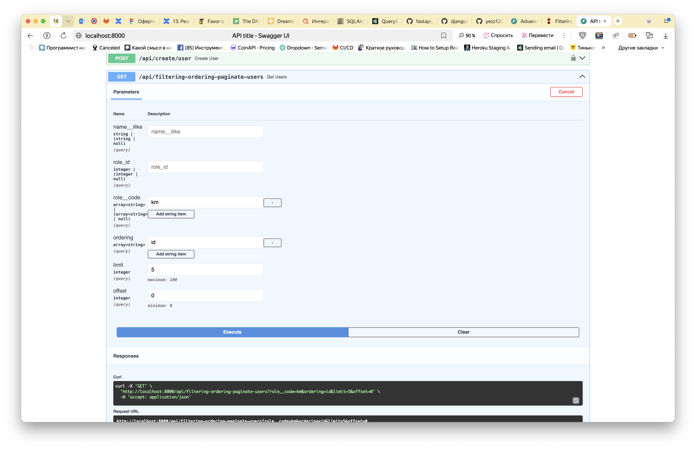

# Фильтрация, пагинация, сортировка

Предлагается объединить в одном сервисе возможности для пагинации, фильтрации, сортировки. 

Это представляет собой класс, который принимает объекты запроса (Request), а также экземпляры объектов фильтрации, 
сортировки, пагинации, которые предоставляют метод `Pagination.paginate_queryset()`, `FilterSet.filter_queryset()` и 
`Ordering.order_queryset()` соответственно.

Базовые классы сервиса и фильтрации, пагинации, сортировки:

```python
from typing import Any

from fastapi import Query, Request
from pydantic import BaseModel, Field

from fastapi_django.db.repositories.queryset import QuerySet


class Ordering(BaseModel):
    ordering: list[str] = Field(Query(default_factory=list))

    def order_queryset(self, queryset: QuerySet) -> QuerySet:
        return queryset.order_by(*self.ordering)


class Pagination(BaseModel):

    async def paginate_queryset(self, queryset: QuerySet) -> Any:
        raise NotImplementedError


class LimitOffsetPagination(Pagination):
    limit: int = Query(10, gt=0, le=100)
    offset: int = Query(0, ge=0)

    async def paginate_queryset(self, queryset: QuerySet) -> Any:
        # пример логики пагинации
        # пагинация знает, какие поля используются при пагинации
        count = await queryset.count()
        data = await queryset[self.offset:self.offset + self.limit]
        return {"count": count, "results": data}


class FilterSet(BaseModel):

    def filter_queryset(self, queryset: QuerySet) -> QuerySet:
        conditions = self.model_dump(exclude_unset=True, exclude_none=True)
        return queryset.filter(**conditions)


class ListService:

    def __init__(self, request: Request | None = None, filterset=None, ordering=None, pagination=None):
        self._request = request
        self._filterset = filterset
        self._ordering = ordering
        self._pagination = pagination

    async def list(self, *args, **kwargs) -> Any:
        queryset = self.get_queryset()
        if self._filterset is not None:
            queryset = self._filterset.filter_queryset(queryset)
        if self._ordering is not None:
            queryset = self._ordering.order_queryset(queryset)
        if self._pagination:
            data = await self._pagination.paginate_queryset(queryset)
        else:
            data = await queryset
        return data

    def get_queryset(self, *args: Any, **kwargs: Any) -> QuerySet:
        raise NotImplementedError

    @classmethod
    def init(cls, *args: Any, **kw: Any) -> Any:
        return cls(*args, **kw)
```

Обратите внимание, что классы FilterSet, Pagination, Ordering являются наследниками pydantic.BaseModel. Это необходимо
для валидации и отображения в свагере.

Реализация:

```python
class UsersFilterSet(FilterSet):
    # TODO: не смог сделать вложенные фильтры
    name__ilike: str | None = Query(None)
    role_id: int | None = Query(None)
    role__code__in: list[str] | None = Field(Query(None, alias="role__code"))  # нужно именно прописывать Field(Query(...)), чтобы корректно отображалось в сваггере


class UsersOrdering(Ordering):
    ordering: list[str] = Field(Query(["id"]))  # нужно именно прописывать Field(Query(...)), чтобы корректно отображалось в сваггере


class UsersListService(ListService):
    # реализация сервиса, который возвращает список пользователей
    # предоставляет возможности для фильтрации, пагинации, сортировки

    def __init__(self, users: UsersRepository, **kw: Any) -> None:
        super().__init__(**kw)
        self._users = users

    def get_queryset(self) -> QuerySet:
        return self._users.objects.all()

    @classmethod
    def init(
        cls,
        request: Request,
        users: UsersRepository = Depends(),
        filterset: UsersFilterSet = Depends(),
        ordering: UsersOrdering = Depends(),
        pagination: LimitOffsetPagination = Depends(),
    ) -> Self:
        # метод, который использует fastapi для инициализации сервиса
        return cls(request=request, users=users, filterset=filterset, ordering=ordering, pagination=pagination)
```

Метод UsersListService.init позволяет прописать все dependency таким образом, чтобы они корректно оторажались в сваггере.

Наконец вьюха:

```python
@router.get(
    "/filtering-ordering-paginate-users",
    dependencies=[Depends(contextify_autocommit_session())]
)
async def get_users(service: UsersListService = Depends(UsersListService.init)):
    return await service.list()
```

Сваггер:



Пример реализации по ссылке https://github.com/albertalexandrov/fastapi-django-example/blob/main/src/web/api/crud/views.py#L60
